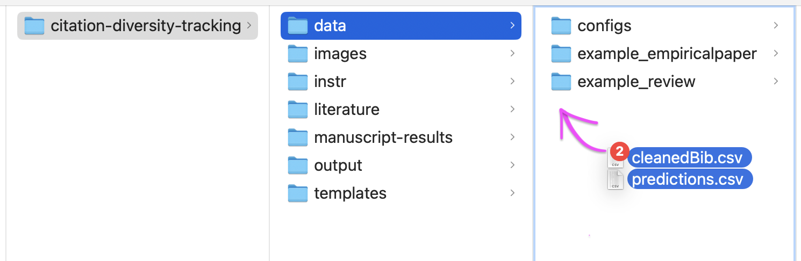

```{r setup, include=FALSE}
knitr::opts_chunk$set(echo = TRUE)
```
  * authored by: **[Lioba Enk](https://www.cbs.mpg.de/person/enk/1770355), Spokesperson for the Diversity and Inclusion Committee (MPI CBS, Leipzig, Germany)^[https://www.cbs.mpg.de/diversity-inclusion-committee; diversity-list@cbs.mpg.de]**
  * last updated: **10 August 2025 | v2.0**

---

```{r}
# import default settings
source(file = file.path("data/configs/default_settings.R"))
```

---

🔵 **CASE LITERATURE REVIEW / META-ANALYSIS** : Note, default is review = 0 (see data/configs/default_settings.R). Compute the same cleanBib analysis on all the references that you review(ed), and save those **in the project folder '/data/ReviewLit/'**. Then activate the line of code below --> review = 1.

```{r, warning=FALSE}

review = 1

if (review == 1) {
  dir.create("data/ReviewLit")
  dir.create("output/OwnCitationBehav")
  dir.create("output/ReviewLit")
}
```

---

#### Description

**This script processes output from [`cleanBib (v1.1.3)`](https://github.com/dalejn/cleanBib)**, an open-source toolbox that allows for the automated estimation of gender by first name. This is done for the first and last authors of each of your cited references, resulting in respectively: M(male, first author)-M(male, last author), F-M, M-F, F-F. For information on how to use the toolbox, check out:

  * /citation-diversity-tracking/instr/instructions_how-to-use-cleanbib.pdf
  
As **cleanBib output** you should have received the following files that are **input to this script**, labelled as:

  * 'predictions.csv'
  * 'cleanedBib.csv'

Those should be **saved in the project folder '/data/'**, before running the following sections.

---

This script enables (**A**) a manual check of estimated gender assignments of first names at first and last author list position of each of your cited publications (as part of your reference list), (**B**) visualizes the proportions of author pairs by itself (your reference list) and against benchmarks taken from [Dworkin et al. (Nat Neurosci 2020)](https://doi.org/10.1038/s41593-020-0658-y) and [Hefter et al. (bioRxiv 2025)](https://doi.org/10.1101/2025.02.19.638905). Lastly, it (**C**) exports your checked predictions file.

```{r, warning=FALSE,echo=FALSE}
# create table with benchmark values
benchmark = read.csv("data/configs/benchmarks_dworkin2020_hefter2025.csv")
benchmark$PublicationYear = as.character(benchmark$PublicationYear)
```


**<span style="color: #ff5f00;">BE AWARE:</span>**

**<span style="color: #ff5f00;">`SECTIONS THAT NEED MANUAL INSERTION MARKED IN ORANGE`</span>**

---

#### (_) Package dependencies
```{r,message=FALSE}
library(rmarkdown)
library(insight)
library(svDialogs)
library(dplyr)
library(tidyr)
library(ggplot2)
library(ggpubr)
library(svglite)
```
#### (_) Benchmark(s)

```{r, echo=FALSE, layout="l-body-outset"}
paged_table(benchmark[,c(1:3,7,10)])
```

---

#### (_) Save input files in '/data'

Save the output files you received from using `cleanBib` as displayed in the picture below.


```{r, echo=FALSE,out.width = "95%"}

```

```{r}

inpath = "data/"
outpath = "output/"

```

---

#### <span style="color: #ff5f00;">(_) Manuscript information</span>

Insert the full names of the authors at first and last position in the author list (of *your own*  project):

  * **Format: "First_name,Last_name"** 
  
*Note: No space after comma & some letters with diacritics, e.g. äüöɫ, are not processed by `cleanBib` and therefore do not appear in their output file `predictions`! <br>So, those may be gone now OR (as adviced in instruction video) written without diacritics.*

```{r}
own_first = "First_name,Last_name"
own_last = "First_name,Last_name"

# case shared authorship: insert, if applies
#own_first2 = "First_name,Last_name"
#own_last2 = "First_name,Last_name"

```

As a next step, please insert the GendCat combination of your first and last authors, i.e.:

  * **FF** = female first author, female last author
  * **MF** = male first author, female last author
  * **FM** = female first author, male last author
  * **MM** = male first author, male last author
  
```{r}
GendCat_FALA = "UU" # U = unknown
```

Lastly, please insert the name of the project, and at which status the manuscript is (default: own_journal = "unpublished", own_year = "noyear", see data/configs/default_settings.R).

```{r}
own_project = "project_name"
own_journal = "unpublished" # bioRxiv, J Neurosci, NeuroImage, PLOS Biolog, ...
own_year = "noyear" # "2022", "2030", ...
```

```{r, echo=FALSE}
if (is.numeric(own_year)) {
  own_year = as.character(own_year)
}
```

---

🔵 **CASE LITERATURE REVIEW / META-ANALYSIS** : As default, self-citations are excluded from analyses, following [Dworkin et al. (Nat Neurosci 2020)](https://doi.org/10.1038/s41593-020-0658-y). In this case, however, we *include* self-citations.


```{r}
if (review == 1) {
  selfcitations_criterion = "include"
}
```

---

Prepare output_file...

```{r}
benchmark = benchmark %>%
  add_row(Author = rep(own_project,2*4),
          Journal = rep(own_journal,2*4),
          PublicationYear = rep(own_year,2*4),
          FA = rep(own_first,2*4),
          LA = rep(own_last,2*4),
          GendCat_FALA = rep(GendCat_FALA,2*4),
          GendCat = benchmark[1:8,"GendCat"],
          singleauthors = rep(c("include", "exclude"), each = 4),
          selfcitations = rep(selfcitations_criterion,8))
```


---

#### (_) Read [cleanBib] input


```{r}
predict_name = "predictions"
cbib_name = "cleanedBib"

predictions = read.csv(paste(inpath,predict_name,".csv",sep=""))
cleanedbib = read.csv(paste(inpath,cbib_name,".csv",sep=""))

if (review == 1) {
  predictions_ReviewLit = read.csv(paste(inpath,"/ReviewLit/",predict_name,".csv",sep=""))
}

```

---

🔵 **CASE LITERATURE REVIEW/META-ANALYSIS** Choose whether to - now & here - analyse your own citation behaviour (OwnCitationBehav - i.e., the one in the main text of your review) or gender composition across the studies you included to the review (ReviewLit).


```{r}

if (review == 1) {
  
  analyse_review_or_ownciting = "review" # "ownciting"
  
  if (analyse_review_or_ownciting == "ownciting") {
      predictions = predictions
  } else if (analyse_review_or_ownciting == "review") {
    predictions = predictions_ReviewLit
    outpath = "output/ReviewLit"
  }
}


```

---

Down below, you see the content of `cleanedBib`. It displays all items from your reference list ('Article'): 

  * the individuals' first names at first ('FA') and last position ('LA') of each respective author list;
  * the publication title ('Title');
  * whether it is a self-citation ('SelfCite' - Y/N)^[Self-citation: the first and last author of your checked project being at first or last position on any of the cited publications];
  * ('CitationKey') that includes the publication year;
  * ('UsedXref')^[*no clue what that means*]
  

```{r, echo=FALSE, layout="l-body-outset"}
paged_table(cleanedbib)
```

---

Down below, you see `predictions` which contains the following information:

  * ('CitationKey') - same as in `cleanedBib`
  * either the first or last author's full name for each cited publication ('Author'), e.g. Muster,Kim
  * the estimated binary gender assignment, i.e. female/male, followed by an accuracy value^[As described in `cleanBib`, a service provided by [gender-api.com](https://gender-api.com) is used for the binary gender assignment. It is probabilistic. The accuracy value (0 *not accurate* - 100 *accurate*) is defined as follows [Gender API (n.d.). [Frequently asked questions: What happens if a name can be male as well as female?](https://gender-api.com/en/frequently-asked-questions#:~:text=The%20value%20is%20calculated%20by,conjugated%20to%20a%20specific%20gender.) (Accessed on 04 January 2024)]: *'The value is calculated by the number of records in our database. For example, if we have 100 samples of a name, 96 are female, and 4 are male, the accuracy is 96% (or a . 96 probability). A low accuracy indicates that this name is probably used by multiple genders and cannot be conjugated to a specific gender.'*] ('Gender'), e.g. female,98
  * ('W')^[Estimated binary assignment to be white (vs. non-white/column A), see [Bertolero et al., (bioRxiv, 2020)](https://doi.org/10.1101/2020.10.12.336230). Visit the Q&A section of citation-diversity-tracking for my explanation on how I *don't* include this piece of information in my analysis.]
  * ('A')^[Estimated binary assignment to be non-white (vs. white/column W), see [Bertolero et al. (bioRxiv, 2020)](https://doi.org/10.1101/2020.10.12.336230). Visit the [Q&A section of citation-diversity-tracking](https://github.com/liobaenk/citation-diversity-tracking#:~:text=(2)%20Why%20is,and%20locally%20sensitive.) for my explanation on how I *don't* include this piece of information in my analysis.]
  * The resulting estimated gender category per author pair, i.e. M-M, F-M, M-F, F-F ('GendCat')

```{r, echo=FALSE, layout="l-body-outset"}
paged_table(predictions)
```

---


#### (A) Check assignments


We wish to **(A.1)** check whether we can find explicit information about the gender of an author, especially in the case of low accuracy, and 
**(A.2)** delete all self-citations (that is any publication with either/or or both of the first and last authors' names).

---

#### <span style="color: #ff5f00;">(A.1) Gender</span>

```{r, echo=FALSE}
g = unique(substr(predictions$Gender, start = 1, stop = 1))
```

**Take a look at the assignments per author**. We advise you to pay special attention to those that have an *assignment probability value of ≤.80*.

```{r, echo=FALSE, layout="l-body-outset"}
paged_table(predictions[,c("X","Author","Gender")])
```

<br>**Which strategy us applied?** Default is it to check all references with assignment probability value of ≤.80 (check_80_and_lower = 1, see data/configs/default_settings.R). You can yet also activate *one* of the lines below (check_all = 1 | check_none = 1).

```{r}
#check_all = 1
#check_none = 1
```

---

<span style="color: #ff5f00;">**Independent of their accuracy value**: Do you wish to check specific names?</span>^[*Why may this be relevant?* You may have noticed above that a name has been *incorrectly* assigned to a binary gender category with >.80 probability. Then you can add it in here to insert the correct value.]

```{r}
# If you want this, insert + activate line below...
selected_names = c("R,Team", "PRISMA,Group") 
```

---

```{r, echo=FALSE}
if (as.character(selected_names)[1] != "0") {
  if (all(selected_names %in% unique(predictions$Author)) == FALSE) {
    cat("Double-check your spelling! Some items do not seem to be in predictions$Author!")
  }
}
```

```{r, echo=FALSE, warning=FALSE}
predictions$Gender_check = "no"
if (check_none != 1) {
  if (check_all) {
    predictions$Gender_check = "yes"
  } else if (check_80_and_lower) {
    predictions$Gender_check = ifelse(is.na(as.numeric(substr(predictions$Gender, #case: accuracy!=100
                                                        start= nchar(predictions$Gender)-2,
                                                        stop=nchar(predictions$Gender)))) == TRUE 
                                      & (as.numeric(substr(predictions$Gender,     #case: accuracy<=80
                                                        start= nchar(predictions$Gender)-1,
                                                        stop=nchar(predictions$Gender))) <= 80 |
                                           is.na(as.numeric(substr(predictions$Gender,     #case: accuracy<=50 --> marked as 'unknown'
                                                        start= nchar(predictions$Gender)-1,
                                                        stop=nchar(predictions$Gender))))), "yes", "no")
    if (as.character(selected_names)[1] != "0") {
      predictions[predictions$Author %in% selected_names, "Gender_check"] = "yes"
    }
  }
}
```

**Down below** you now see all names that need manual checking by you, here (default strategy): **those with accuary value ≤ 80 (default)**.

```{r, echo=FALSE, layout="l-body-outset"}
check_predictions = predictions[(predictions$Gender_check == "yes"),]
paged_table(check_predictions[,c("CitationKey", "Author", "Gender","Gender_check")])
```

---

<span style="color: #ff5f00;">Following an online search on those names (or else strategy), **insert your <span style="color: red;">response</span> in the window below, as follows:** 

- <span style="color: red;">**Options:** "male" "diverse" "female", "unknown"</span>

```{r}

check_predictions$Gender_posthoc = c(
  
  # example
  # "male", "female", "female", "female", "male", "female", "female", "male", "female"
  
  #"NA", "NA", "NA", "NA", "NA", "NA", "NA", "NA", "NA", "NA",
  #"NA", "NA", "NA", "NA", "NA", "NA", "NA", "NA", "NA", "NA",
  #"NA", "NA", "NA", "NA", "NA", "NA", "NA", "NA", "NA", "NA"

  )
```

*Post-hoc note*: Why appear some names multiple times? To save you time, it would be nicer to have each author('s name) only once. The issue here is that Non-ASCII characters (such as áşıñ) are deleted in the cleanBib output files (v1.1.3). Therefore it can happen that one author is listed with different incomplete names. I therefore decided that all entries should be checked.

---

**Now, are you happy with the <span style="color: red;">results</span>? (below)**

- If yes --> proceed. 
- If not --> insert <span style="color: red;">new response</span> in previous section and re-run.


```{r, echo=FALSE, layout="l-body-outset"}
paged_table(check_predictions[,c("CitationKey", "Author", "Gender","Gender_check", "Gender_posthoc")])
```

**If happy,**

- the manually inserted variable **'Gender_posthoc'** (see table above) is stored
- variable **'GendCat_posthoc'** (i.e. dyadic gender information per publication) is created 

in `predictions`.

```{r}
# Insert manual Gender_posthoc
predictions$Gender_posthoc = NA
predictions[(predictions$Gender_check == "no"),"Gender_posthoc"] = 
  substring(predictions[(predictions$Gender_check == "no" | is.na(predictions$Gender_check)),"Gender"], 1, 1)
for (i in 1:nrow(check_predictions)){
  predictions[(predictions$Author == check_predictions$Author[i]),
            "Gender_posthoc"] = substring(check_predictions$Gender_posthoc[i],1,1)
}
#GendCat_posthoc
predictions$GendCat_posthoc = NA
predictions[(predictions$GendCat != ""), "GendCat_posthoc"] = paste(
  predictions[predictions$GendCat == "","Gender_posthoc"], #FA
  predictions[predictions$GendCat != "", "Gender_posthoc"],sep="") #LA
```

Final output file `predictions`:

```{r, echo=FALSE, layout="l-body-outset"}
paged_table(predictions[,c("X","CitationKey","Author","Gender","Gender_check", "Gender_posthoc", "GendCat_posthoc")])
```

---

🔵 **CASE LITERATURE REVIEW/META-ANALYSIS** and use this tool, the following section...

  * identifies references cited in the main text (own_citation_behaviour) that are also in the reviewed literature (reviewed_body)
  * identifies references cited in the main text that are not part of the reviewed body
  * calculates the proportion of the reviewed body that is cited in the main text
  
This is done to distinguish between (1) references from the reviewed literature and (2) additional sources cited in the review's main text.

```{r}

if (review == 1) {
  
  if (analyse_review_or_ownciting == "ownciting") {
    
    # get number of reviewed papers (size of reviewed body)
  n_reviewed = length(unique(predictions_ReviewLit$CitationKey))
  
  #create dataframes (for own citation behaviour!)
  predictions_own_ReviewLit = semi_join(predictions, 
                                        predictions_ReviewLit, 
                                        by = c("CitationKey", "Author"))
  predictions_own_new = anti_join(predictions, 
                                  predictions_ReviewLit, 
                                  by = c("CitationKey", "Author"))
  
  # get number of reviewed papers cited in main text (i.e., OwnCitationBehav & part of ReviewLit)
  n_reviewed_cited = length(unique(predictions_own_ReviewLit$CitationKey))
  
  # percent
  percent_reviewed_cited = round(n_reviewed_cited / n_reviewed * 100,3)
  
  cat(paste0(
    "**", n_reviewed_cited, " of ", n_reviewed,
    " (", percent_reviewed_cited, " %)**",
    " reviewed studies (ReviewLit) were also cited in the main text (OwnCitationBehav)."
    ))
  
  }
}

```


---


#### (A.2) Self-citations


```{r, echo=FALSE, layout="l-body-outset"}
predictions$SelfCite_posthoc <- ifelse(
  predictions$Author == own_first | predictions$Author == own_last | 
    predictions$Author == own_first2 | predictions$Author == own_last2
  , "Y", "N")

df = predictions[predictions$SelfCite_posthoc == "Y", ]
df = predictions[(predictions$CitationKey %in% df$CitationKey),]
num_selfcitation = length(unique(df$CitationKey))

summary_selfcite = data.frame(matrix(NA, nrow = 4, ncol = 2))
summary_selfcite[1,] = c("MM",length(which(df$GendCat_posthoc == "mm")))
summary_selfcite[2,] = c("FM",length(which(df$GendCat_posthoc == "fm")))
summary_selfcite[3,] = c("MF",length(which(df$GendCat_posthoc == "mf")))
summary_selfcite[4,] = c("FF",length(which(df$GendCat_posthoc == "ff")))
summary_selfcite$X1 = factor(summary_selfcite$X1 , levels = c("MM", "FM", "MF", "FF"))
summary_selfcite$X2 = as.numeric(summary_selfcite$X2 )

```


```{r, echo=FALSE, layout="l-body-outset"}
paged_table(df)
```

Next, this code excludes self-citations from the main data set. *Why?* We follow the procedure taken by [Dworkin et al. (Nat Neurosci 2020)](https://doi.org/10.1038/s41593-020-0658-y).


```{r}
if (review == 0) {
  predictions = predictions[!(predictions$CitationKey %in% df$CitationKey),]
}
```


---

#### (_) Unknown citations

Be reminded that those are first names that had an assignment probability below .80, and could not assigned through a manual search. Those can also be references authored by a consortium (e.g., one of the Enigma Groups), or software references (such as 'R Team').^[Possible improvement in the future: Disentangle references with authoring individuals/names vs. software/data references.]

```{r, echo=FALSE}

# identify amount of authors & pairs with >= unknown gender (i.e., == "u")
n_unknown_pairs = predictions[grep("u", predictions$GendCat_posthoc), ]

# take out unknown authors
df_plot = predictions[!(predictions$CitationKey %in% n_unknown_pairs$CitationKey), ]
```

```{r, echo=FALSE, layout="l-body-outset"}
paged_table(predictions[(predictions$CitationKey %in% n_unknown_pairs$CitationKey), ])
```

---

#### (_) Single-authored citations

```{r, echo=FALSE}
# identify single-authored papers
predictions$SingleAuthor = NA
for (i in 1:nrow(predictions)) {
  predictions[(predictions$CitationKey == predictions$CitationKey[i]),"SingleAuthor"] = if_else(
    predictions[(predictions$CitationKey == predictions$CitationKey[i]),"Author"][1] == 
      predictions[(predictions$CitationKey == predictions$CitationKey[i]),"Author"][2],1,0)
}
singleauthor_ff = predictions[(predictions$GendCat_posthoc == "ff" & !is.na(predictions$GendCat_posthoc) & predictions$SingleAuthor == 1),]
singleauthor_mm = predictions[(predictions$GendCat_posthoc == "mm" & !is.na(predictions$GendCat_posthoc) & predictions$SingleAuthor == 1),]
singleauthors = rbind(singleauthor_ff, singleauthor_mm)

summary_singleauthors = data.frame(matrix(NA, nrow = 2, ncol = 2))
summary_singleauthors[1,] = c("FF",length(which(singleauthors$GendCat_posthoc == "ff")))
summary_singleauthors[2,] = c("MM",length(which(singleauthors$GendCat_posthoc == "mm")))
summary_singleauthors$X1 = factor(summary_singleauthors$X1 , levels = c("MM","FF"))
summary_singleauthors$X2 = as.numeric(summary_singleauthors$X2 )
```

```{r, echo=FALSE, layout="l-body-outset"}
paged_table(singleauthors)
```

---

#### (B) Plot


```{r, echo=FALSE}

# identify highest n (single_authors vs. self-citations)
a = if_else(sum(summary_selfcite$X2) > sum(summary_singleauthors$X2), 1,0)
if (a == 1) {
  max_addon_plots = max(summary_selfcite$X2)
} else {
  max_addon_plots = max(summary_singleauthors$X2)
}

```

```{r, echo=FALSE}

df_plot$GendCat_posthoc <- factor(df_plot$GendCat_posthoc, 
                                      levels = c("mm", "fm", "mf", "ff"))

if (review == 0) {
  
  your_summary = df_plot[(df_plot$GendCat != "" & df_plot$SelfCite_posthoc == "N"),] %>%
  group_by(GendCat_posthoc) %>%
  summarise(your_count = n(),
            your_percent = n() / nrow(df_plot[(df_plot$GendCat != "" & df_plot$SelfCite_posthoc == "N"),]) * 100)
  
  } else if (review == 1) {
  
  your_summary = df_plot[(df_plot$GendCat != ""),] %>%
  group_by(GendCat_posthoc) %>%
  summarise(your_count = n(),
            your_percent = n() / nrow(df_plot[(df_plot$GendCat != "" & df_plot$SelfCite_posthoc == "N"),]) * 100)
  }


# correct for single authored papers

if (sum(summary_singleauthors$X2) > 0) {
  your_summary$your_count_singleauthors = c(summary_singleauthors[(summary_singleauthors$X1 == "MM"),"X2"],0,0,
                                            summary_singleauthors[(summary_singleauthors$X1 == "FF"),"X2"])
  your_summary$your_percent_wo_singleauthors = (your_summary$your_count - your_summary$your_count_singleauthors) / 
    (nrow(df_plot[df_plot$GendCat != "",]) - sum(your_summary$your_count_singleauthors)) * 100
}


# format for visualisation/plotting

benchmark$p_results = rep(1:(nrow(benchmark)/4), each = 4)
benchmark$p_results = as.factor(benchmark$p_results)
benchmark$GendCat = factor(benchmark$GendCat, levels = c("MM", "FM", "MF", "FF"))

# reformat

benchmark[benchmark$Author == own_project & benchmark$singleauthors == "include","percent"] = your_summary$your_percent
benchmark[benchmark$Author == own_project & benchmark$singleauthors == "include","count"] = your_summary$your_count
if (sum(summary_singleauthors$X2) > 0) {
  benchmark[benchmark$Author == own_project & benchmark$singleauthors == "exclude","percent"] = your_summary$your_percent_wo_singleauthors
  benchmark[benchmark$Author == own_project & benchmark$singleauthors == "exclude","count"] = your_summary$your_count - your_summary$your_count_singleauthors
  #benchmark = benchmark[!(benchmark$Author == own_project & benchmark$singleauthors == "exclude"),]
}


```

Load plot settings ...

```{r}
source(file = file.path("data/configs/plot_settings.R"))
``` 

Plotting ...

```{r, warning=FALSE}

# bar plot (counts)
p2_data = benchmark[benchmark$Author == own_project & benchmark$singleauthors == "include",]
p2 = ggplot(data=p2_data, 
            aes(x=GendCat, y=count)) + 
  geom_bar(stat="identity", fill = p_colours[3], width= 0.7) +
  geom_text(aes(label=count), vjust=-0.3, size=4) +
  scale_x_discrete(labels= c("MM","FM","MF","FF")) +
  scale_y_continuous(breaks = c(seq(0,p2_y_seqmax,10)),limits = c(0,(max(p2_data$count)+5))) +
  labs(y="Count") +
  p2_theme
  

# joint plot (line plot against benchmark + p2)
p3 = ggplot(benchmark, aes(x=GendCat, y=percent, group=p_results, color=p_results)) +
    geom_hline(yintercept=25, color = ref_colour, linetype = "dotted")+
  geom_line(aes(color=p_results))+
  geom_point(aes(color=p_results))+
  scale_y_continuous(breaks = c(seq(0,p3_seqmax, 10)), 
                     limits = c(0,max(benchmark$percent)+2)) +
  p3_theme +
  annotation_custom(
    ggplotGrob(p2),
    xmin = p3_annotating_p2_inside_parameters[1], 
    xmax = p3_annotating_p2_inside_parameters[2],
    ymin = p3_annotating_p2_inside_parameters[3],
    ymax = p3_annotating_p2_inside_parameters[4]
    )
if (review == 0) {
  p3 = p3 +
    p3_labels +
    p3_scale_color_manual
} else if (review == 1) {
  if (analyse_review_or_ownciting == "ownciting") {
    p3 = p3 +
    p3_labels_review_ownciting +
    p3_scale_color_manual_review_ownciting
  } else if (analyse_review_or_ownciting == "review") {
    p3 = p3 +
    p3_labels_review_lit +
    p3_scale_color_manual_review_ownciting
  }
  
}

p4 = ggplot(data=summary_singleauthors, aes(x=X1, y=X2)) +
  geom_bar(stat="identity", fill = p_colours[4], width= 0.7)+
  scale_y_continuous(breaks = c(seq(0,p45_seqmax,2)), limits = c(0,max_addon_plots+2))+
  labs(y="Single-authored, Count")+
  p45_theme

p5 = ggplot(data=summary_selfcite, aes(x=X1, y=X2)) +
  geom_bar(stat="identity", col = p5_colour, fill = "white", width= 0.7)+
  scale_y_continuous(breaks = c(seq(0,p45_seqmax,2)), limits = c(0,max_addon_plots+2))+
  labs(y="Self-cited, Count")+
  annotate(geom="text", 
           x=2.5, 
           y=sum(summary_selfcite$X2)+1, 
           label=paste(as.character(
             round( length(unique(df$CitationKey)) / 
                      (sum(your_summary$your_count) + nrow(n_unknown_pairs)) * 100,2)),
                       "%","\nof all citations","\n(n=",
             as.character(sum(your_summary$your_count) + nrow(n_unknown_pairs)),")", sep=""),
              color="black", size=rel(4))+
    p45_theme


ggarrange(p3, p4, p5, ncol = 3, widths = c(7,1,1.6), align = "hv")
  
ggsave(width = 12, height = 6,
  paste(outpath,
        format(Sys.time(), '%Y%m%d'),"_",own_project,
        "_citationdiversitytracking_plot.svg",sep=""))

```

---

#### (C) Save in '/output'

```{r}

if (nrow(df) != 0) {
  write.csv(df,paste(outpath,
                     format(Sys.time(), '%Y%m%d'),"_",own_project,
                     "_citationdiversitytracking_selfcitations.csv",sep=""))
}
if (nrow(singleauthors) != 0) {
  write.csv(singleauthors,paste(outpath,
                                format(Sys.time(), '%Y%m%d'),"_",own_project,
                                "_citationdiversitytracking_singleauthors.csv",sep=""))
}

write.csv(predictions,paste(outpath,
                            format(Sys.time(), '%Y%m%d'),"_",own_project,
                            "_citationdiversitytracking_",predict_name,"_checked.csv",sep=""))


write.csv(benchmark,paste(outpath,
                          format(Sys.time(), '%Y%m%d'),"_",own_project,
                         "_citationdiversitytracking_summary.csv",sep=""))

```

```{r, echo=FALSE, layout="l-body-outset"}
paged_table(benchmark)
```

---
 
#### <span style="color: #ff5f00;">(D.1) *Contribute with your output?*</span>
*What is required?*

**It is either the first or last author that uploads the output.**

  * Given that, the following is asked for:
    * Some personal information
    * Manuscript information (authors, publication status)
    * files '...trackcitingbehav_predictions_checked.csv' & '...trackcitingbehav_summary.csv'
    
~~**[Click here (Survey)]()**<br>~~
Note (09.08.2025): will be updated and published soon again. Please reach out if interested!


---

#### <span style="color: #ff5f00;">(D.2) *Support this initiative?*</span>

~~**[_Click here for more information (Survey)_]()**~~<br>
Note (09.08.2025): will be updated and published soon again. Please reach out if interested!


---

**DONE!**

---

#### Acknowledgements 

My thanks go to my colleagues [Paul Steinfath](https://www.cbs.mpg.de/person/steinfath/371395), [Nick Kapralov](https://www.cbs.mpg.de/employees/kapralov) and [Magda Gippert](https://www.cbs.mpg.de/employees/gippert) for their valuable feedback, recommendations, and interest. Finally, heartfelt thanks to all members of the Diversity & Inclusion Committee of the MPI CBS in Leipzig — especially to [Jo Finnemann](https://www.cbs.mpg.de/employees/finnemann)! 🦋

---

